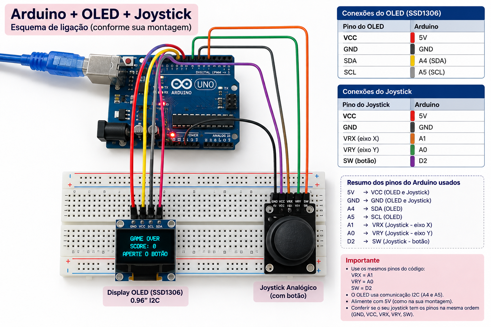

# 🎮 Jogo Arduino + OLED

Um pequeno jogo desenvolvido com Arduino, display OLED e joystick.

Este projeto foi desenvolvido como um projeto prático de eletrônica e programação,
explorando leitura de entradas, controle de um personagem e renderização gráfica
em um display OLED.

## 🛠️ Componentes

- Arduino
- Display OLED
- Joystick analógico
- Jumpers
- Protoboard

## 🎮 Controles

O personagem é controlado pelo joystick:

- ⬆️ Cima
- ⬇️ Baixo
- ⬅️ Esquerda
- ➡️ Direita

## 💻 Tecnologias

- Arduino
- C/C++
- Eletrônica
- Display OLED
- Joystick analógico

## 📸 Projeto

### 🔌 Esquema de montagem

### 🎥 Demonstração

[▶️ Assistir ao SpaceRun no YouTube](https://youtube.com/shorts/NZHqormcSE0?feature=share)

## 🚀 Objetivo

Este projeto faz parte dos meus estudos em programação,
eletrônica e sistemas embarcados.

## 👩‍💻 Desenvolvido por

**Laure Cristine**

